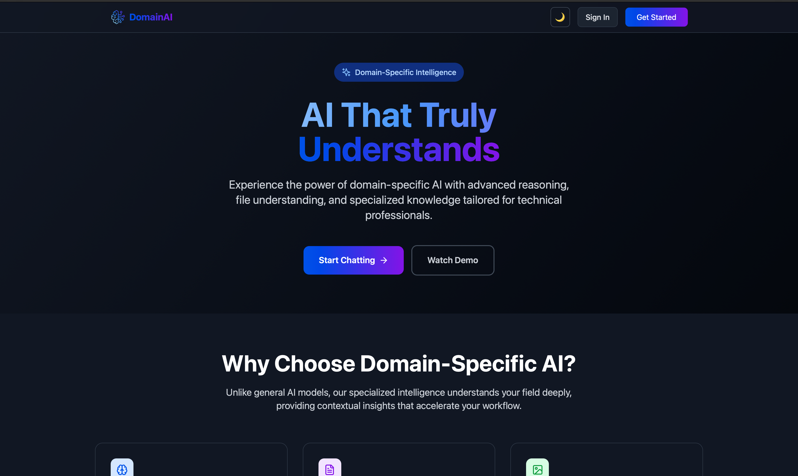
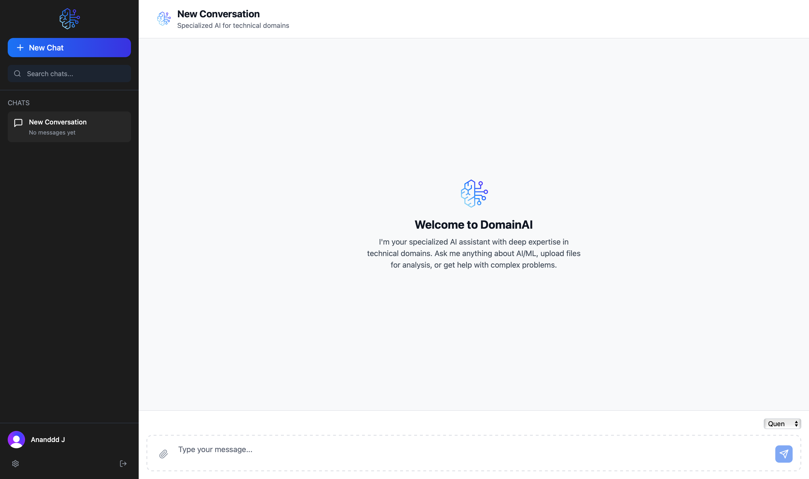
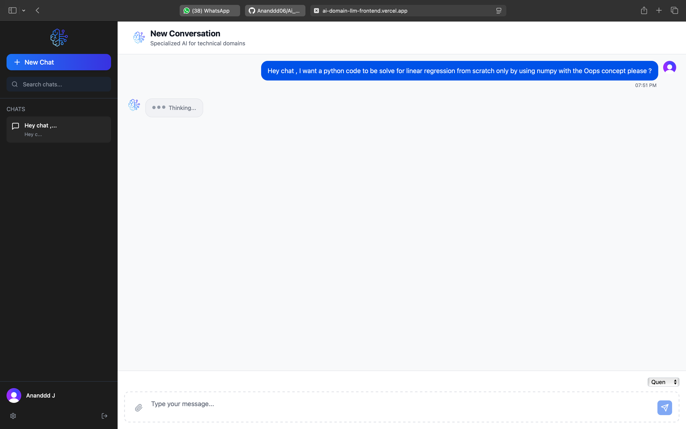
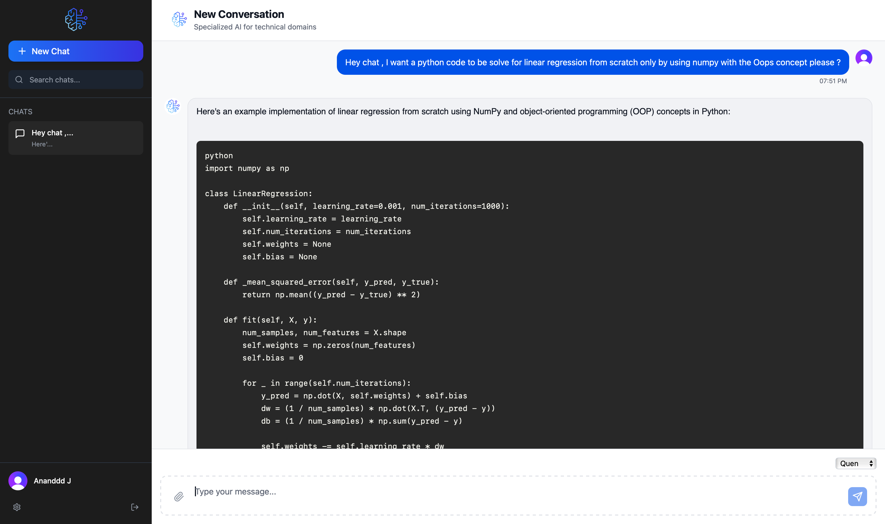

# Ai_Domain_LLM_Frontend 🤖💬

[](https://opensource.org/licenses/MIT)
[](./CONTRIBUTING.md)

An open-source, beautifully designed chat interface for interacting with Large Language Models (LLMs). This project provides a clean, elegant, and responsive frontend, similar to ChatGPT, allowing you to build your own conversational AI applications with ease.

## 📸 Screenshots

Here's a glimpse of the application in action, from the front page to an active conversation.

### Front Page & Login

_The first impression of the application and the secure login screen._

<p align="center">
  
  
</p>

### Chat Interface

_A clean, elegant, and responsive UI for interacting with the AI._

<p align="center">
  
</p>

### Real-time Interaction

_The interface clearly indicates when the AI is thinking and then streams the response back to the user._

<p align="center">
  
  
</p>

---

## ✨ Features

- **Elegant & Responsive UI**: A thoughtfully designed interface that looks great on all devices, from desktops to mobile phones.
- **Real-time Streaming**: Watch the AI's response generate in real-time for a dynamic and engaging user experience.
- **Connects to OpenRouter**: Easily connect to hundreds of LLMs (including free ones) through the [OpenRouter.ai](https://openrouter.ai/) API.
- **Open Source & Customizable**: The code is yours to explore, modify, and tailor to your specific needs.
- **Modern Tech Stack**: Built with the latest web technologies for a powerful and maintainable codebase.

## 🛠️ Tech Stack

This project is built with a modern, robust tech stack:

- **[React](https://reactjs.org/)**: A JavaScript library for building user interfaces.
- **[TypeScript](https://www.typescriptlang.org/)**: For strong typing, better developer experience, and fewer bugs.
- **HTML5 & CSS3**: For structure and beautiful styling.

## 🚀 Getting Started

Follow these steps to get a local copy up and running.

### Prerequisites

Make sure you have the following installed on your machine:

- [Node.js](https://nodejs.org/en/) (v18 or newer)
- [npm](https://www.npmjs.com/) or [yarn](https://yarnpkg.com/)

### Installation

1.  **Clone the repository:**

    ```sh
    git clone https://github.com/your-username/Ai_Domain_LLM_Frontend.git
    cd Ai_Domain_LLM_Frontend
    ```

2.  **Install dependencies:**

    ```sh
    npm install
    # or
    yarn install
    ```

3.  **Set up environment variables:**

    This project is configured to use OpenRouter.ai, which gives you access to a wide variety of models, including many free ones.

    1.  Go to OpenRouter.ai and create a free account.
    2.  On the Keys page, create a new key.
    3.  Create a `.env.local` file in the root of your project and add your key:

    ```env
    # .env.local
    VITE_OPENROUTER_LLAMA_KEY="your-openrouter-api-key-here"
    ```

4.  **Run the development server:**
    ```sh
    npm run dev
    # or
    yarn dev
    ```

Open http://localhost:3000 (or your configured port) in your browser to see the application.

## 🤝 Contributing

Contributions are what make the open-source community such an amazing place to learn, inspire, and create. Any contributions you make are **greatly appreciated**.

If you have a suggestion that would make this better, please fork the repo and create a pull request. You can also simply open an issue with the tag "enhancement".

1.  Fork the Project
2.  Create your Feature Branch (`git checkout -b feature/AmazingFeature`)
3.  Commit your Changes (`git commit -m 'Add some AmazingFeature'`)
4.  Push to the Branch (`git push origin feature/AmazingFeature`)
5.  Open a Pull Request

## 📄 License

Distributed under the MIT License. See `LICENSE` for more information.

---

Made with ❤️ for the AI community.
